[Heroku 101](https://github.com/ibigfoot/heroku-101) | [Heroku 201](https://github.com/ibigfoot/heroku-201) | [Heroku 301](https://github.com/ibigfoot/heroku-301) | [Heroku 401](https://github.com/ibigfoot/heroku-401)

# Heroku 201

You have now created a Java application and configure it to run in Heroku. Hopefully you have investigated using the scale commands (or the UI) and are ready to get started on the next stage. If you haven't, clone [this](https://github.com/ibigfoot/heroku-training.git) repository to get back to the starting position for this exercise. Remember you might want to update the artifact name in the pom.xml to reflect we are now in the 201 exercise, but everything else should be the same!

In this excercise we are going to create a clone of a Salesforce database in Postgres, then connect our Java application to the database to render to a JSON stream. We will also connect directly to our database via JDBC and explore the nature of the tables created by the Heroku Connect addon. 

## Prerequisites 
To start with we are going to need a Salesforce instance to connect to! So jump over to [developer.salesforce.com](https://developer.salesforce.com/signup) and create yourself a brand new developer environment for Salesforce. Remeber when you sign up that your user name needs to be in the form of an email address, but it is best to put something else there for these types of exercises. I have used "troy@heroku.training".

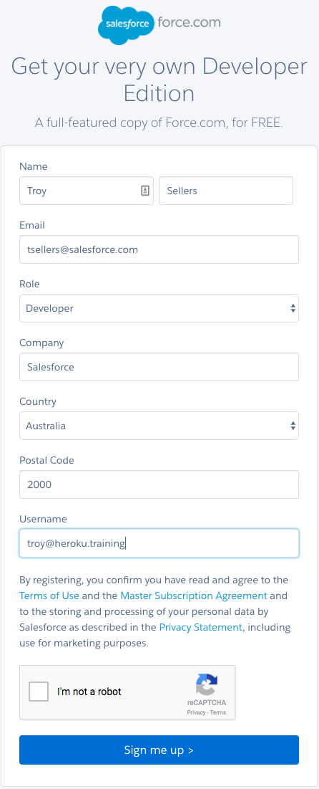

You should use an email address that you have access to here in the classroom so you can sign in to your Salesforce instance.

If you haven't complete heroku-101, there is some installed tools listed there that you will need to complete this lab as well. 
On top of these, there is an "extra-credit" exercise at the end that will require you to have Postgres installed.

## Heroku Add Ons
So we need to provision a couple of different [Heroku Addons](https://elements.heroku.com/addons) for this exercise, [Heroku Postgres](https://www.heroku.com/postgres) and [Heroku Connect](https://www.heroku.com/connect).

You can do this via either the CLI or via the Dashboard, lets step through both ways so we can compare the differences.  

### Heroku Postgres (via the CLI)

Make sure you are in your heroku-201 directory.

```
> cd heroku-201
```

Let's create another app in Heroku for this one, remember our git init then Heroku create commands? 

```
> git init
> heroku create troys-heroku-201
```

Notice how this time I have specified an app name, you might try this. Don't worry if it fails, it might just be that you have chosen a name that already exists in the ecosystem. An excellent question that I would like someone to test is "can you put korean in the app name"?

Here is the output of my create process

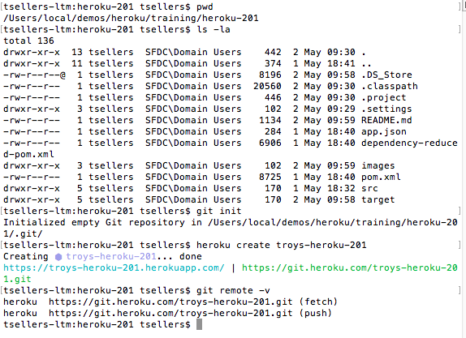

Let's initialise a git repository, add our code to it and into Heroku. Then, check everything is working

```
> git add .
> git commit -am "initial commit"
... much git output ...
> git push heroku master
... much build output... 
> heroku open
```

Excellent, now we can provision and configure our addons

```
> heroku addons:services
```

This will display a complete list of addons for you to choose from, there are over 150+ different services on Heroku today. 
We are interested in Heroku Postgres, but first we probably want to see what plans are available to us.

```
> heroku addons:plans heroku-postgresql
```

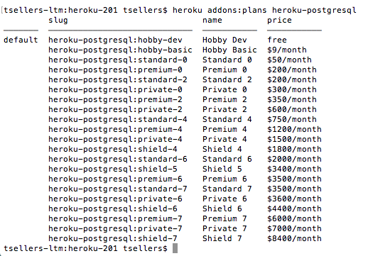

Excellent, like nearly all Heroku Addons there is a free tier, so lets use that one. 
We provision an addon by using the Heroku CLI command 'create'.

```
> heroku addons:create heroku-postgresql:hobby-dev
```

Notice how in the command we also specify which plan to create and attach to this application. 
Once complete, you can see that we have also created a Configuration Variable and made it available to this app. 

```
> heroku config
```

The full output of all these commands should resemble this.

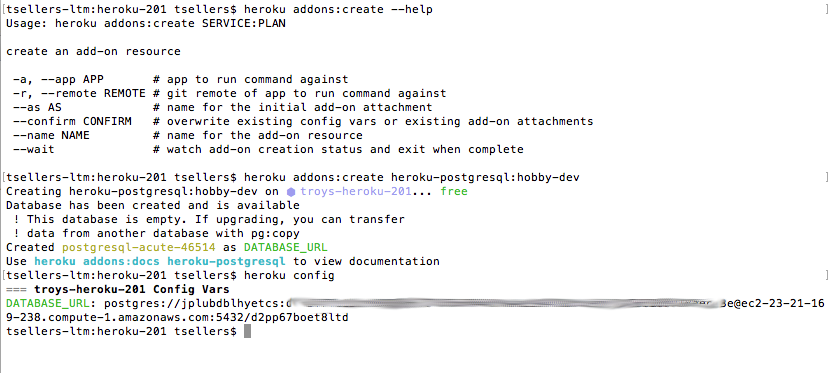

So excellent, we now have a postgres database that we can use. Step 1 complete.

### Heroku Connect (via the Dashboard)

As we mentioned above, there are two different ways to create and attach addons to an application via the CLI and the Heroku Dashboard. 
Let's find and add the Heroku Connect addon via the dashboard, once we have we can configure Heroku Connect to sync our newly created Salesforce instance.

Open the Heroku Dashboard and find your application, in my case it is troys-heroku-201 but yours will be named differently. 

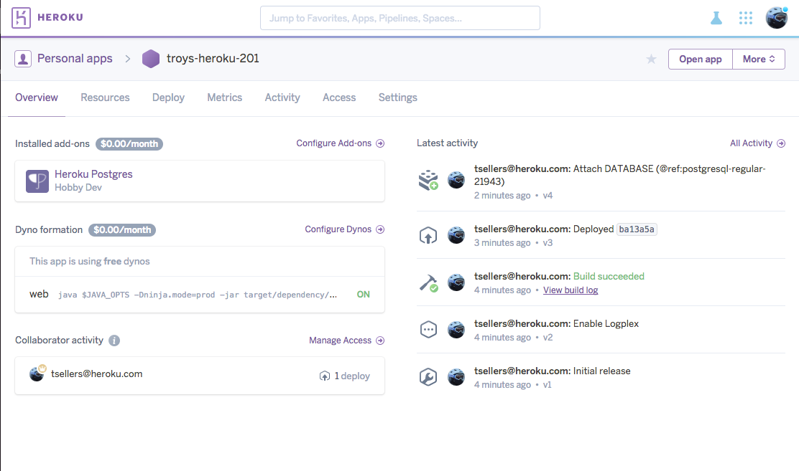

Click on the resources subtab and search for Heroku Connect, go ahead and add the free version.

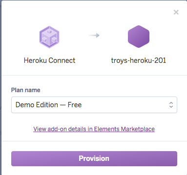

Now we need to configure our Heroku Connect to point to the Salesforce Developer environment we created earlier. In the resources list you should see the provisioned Heroku Connect, go ahead and click on this and go to the Connect dashboard.

Click the big "Setup Connection" button.

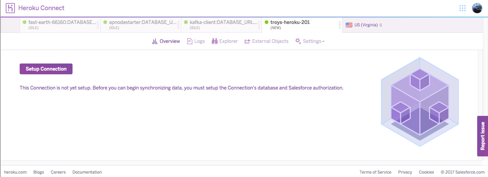

Next you have the opportunity to configure the [Postgres Schema](https://www.postgresql.org/docs/9.6/static/ddl-schemas.html) name that Heroku Connect will use to store Salesforce tables. I always just leave the defaults..

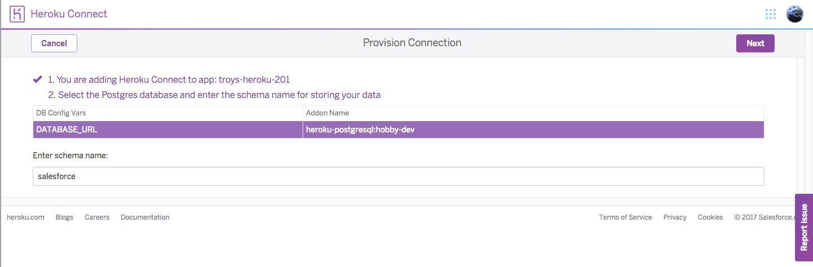

Click next and then choose your Salesforce API level (again, I always just leave the defaults).. then click Authorize
This will take you to Salesforce where you enter your credentials and give permission for Heroku Connect to access your Salesforce instance via the API... the OAuth dance begins.

Login...

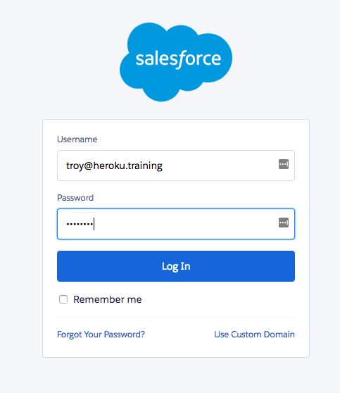

You might have to use a 2nd factor to verify your identity
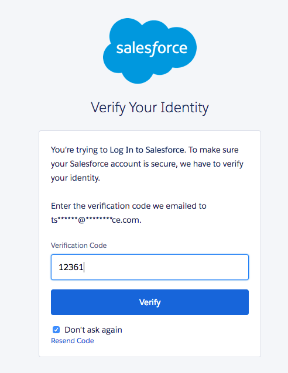

Then you grant Heroku Connect access
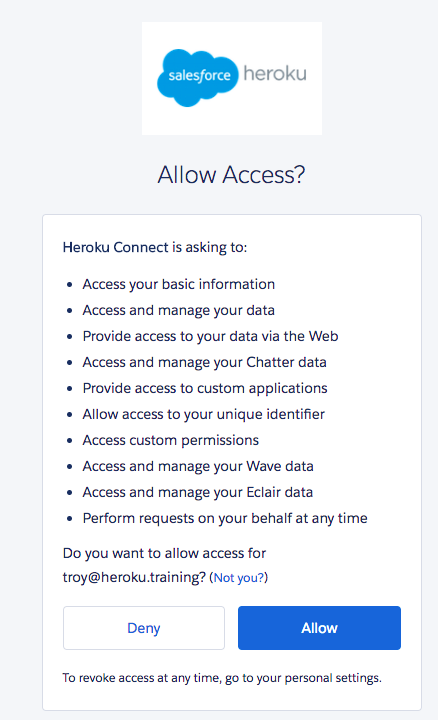

Now we are ready to configure the tables we want to sync, lets go ahead and hit the create mapping button.

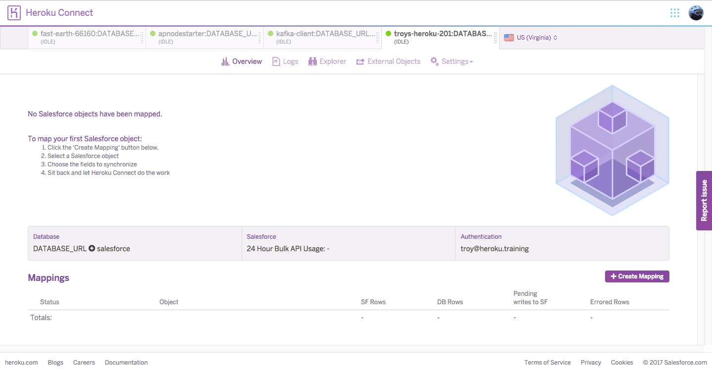

This will load a list of all the available Salesforce objects that can be synced, lets just click on the account and choose some fields.
I chose some billing fields, name and account number. 

What's important to notice here is that I have also configure my sync to be bi-directional as well as listening for Streaming API updates. It is worth reading the [Heroku Connect FAQ](https://devcenter.heroku.com/articles/heroku-connect-faq) if you are thinking of using this in production as there is plenty of good detail about how the sync works.

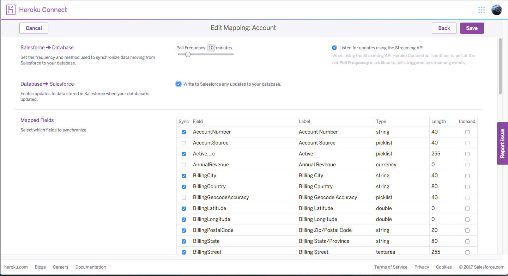

Click save and you will be able to watch the database rows sync, not many as we only started with a developer org! 


## Connect the Java App
So we have everything loaded and ready to go, but we need to connect our app to this. Let's use the Java Persistence API ([JPA](https://en.wikipedia.org/wiki/Java_Persistence_API)) in our app to allow us to configure a connection to the database. 

Firstly, lets configure you database to work locally with test and then work on production. Your configuration begins at the application.conf file. (src->main->java-conf)

There are a few lines you need to add

```
ninja.jpa.persistence_unit_name=h2_test
db.connection.url=jdbc:h2:./target/h2database
db.connection.username=ra
db.connection.password=
```

These lines are telling Ninja that when it starts it should look for the persitence unit named 'h2_test' and start it with the database credentials shown. This is OK as it is a simple test database. 

Now, let's add a persistence.xml file into our project. 
Create a META-INF directory at src->main->java and add this persistence.xml file

```
<?xml version="1.0" encoding="UTF-8"?>
<!--

    Copyright (C) 2012-2016 the original author or authors.

    Licensed under the Apache License, Version 2.0 (the "License");
    you may not use this file except in compliance with the License.
    You may obtain a copy of the License at

        http://www.apache.org/licenses/LICENSE-2.0

    Unless required by applicable law or agreed to in writing, software
    distributed under the License is distributed on an "AS IS" BASIS,
    WITHOUT WARRANTIES OR CONDITIONS OF ANY KIND, either express or implied.
    See the License for the specific language governing permissions and
    limitations under the License.

-->

<persistence xmlns="http://java.sun.com/xml/ns/persistence"
    xmlns:xsi="http://www.w3.org/2001/XMLSchema-instance"
    xsi:schemaLocation="http://java.sun.com/xml/ns/persistence http://java.sun.com/xml/ns/persistence/persistence_2_0.xsd"
    version="2.0">


    <!-- h2 is a simple database - in reality you may want to switch to postgres or so... -->
    <persistence-unit name="h2_test" transaction-type="RESOURCE_LOCAL">
        <provider>org.hibernate.jpa.HibernatePersistenceProvider</provider>
        <properties>
            <property name="javax.persistence.provider" value="org.hibernate.jpa.HibernatePersistenceProvider" />
            <property name="hibernate.connection.driver_class" value="org.h2.Driver" />
            <property name="hibernate.dialect" value="org.hibernate.dialect.H2Dialect" />
            <!-- you may want to enable the ddl if you do not use migrations. -->
            <!--  <property name="hibernate.hbm2ddl.auto" value="create" /> -->
            <property name="hibernate.show_sql" value="false" />
            <property name="hibernate.format_sql" value="false" />
            
            <!-- Connection Pooling settings -->
            <property name="hibernate.connection.provider_class"
                value="org.hibernate.service.jdbc.connections.internal.C3P0ConnectionProvider" />
            <property name="hibernate.connection.autocommit" value="false"/>
            
            <property name="hibernate.c3p0.max_size" value="10" />
            <property name="hibernate.c3p0.min_size" value="0" />
            <property name="hibernate.c3p0.acquire_increment" value="1" />
            <property name="hibernate.c3p0.idle_test_period" value="300" />
            <property name="hibernate.c3p0.max_statements" value="0" />
            <property name="hibernate.c3p0.timeout" value="100" />     
        </properties>
    </persistence-unit>

</persistence>
```

Looking closely you will see that we are using C3P0 for connection pooling, so lets add that dependency to our pom.xml

```
<dependency>
	<groupId>com.mchange</groupId>
	<artifactId>c3p0</artifactId>
	<version>0.9.5.2</version>
</dependency>
```

Now, let's test our data connections

```
> mvn clean package ninja:run
```

You should see your server start without errors and everything is fine. It's worthwhile to scroll up the log a little and see where the persistence unit was loaded and check.

But what about production? This is just a simple in memory thing, and definitely not our postgres we are wanting. For this, we want a few extra steps.

Firstly, back to our pom.xml to add another dependency, this time the Postgres database driver

```
<dependency>
	<groupId>org.postgresql</groupId>
	<artifactId>postgresql</artifactId>
	<version>9.4.1211.jre7</version>
</dependency>
```

Now we can add our Postgres persitence unit to the persitence.xml. We can actually just add this below the one that exists already
Notice we have specified different drivers and dialects here. 

```
<!-- production persistence unit -->
<persistence-unit name="connect_pu" transaction-type="RESOURCE_LOCAL">
    <provider>org.hibernate.jpa.HibernatePersistenceProvider</provider>

    <properties>
        <property name="hibernate.connection.driver_class" value="org.postgresql.Driver"/>
        <property name="hibernate.dialect" value="org.hibernate.dialect.PostgreSQLDialect" />

         <!-- Connection Pooling settings -->
        <property name="hibernate.connection.provider_class"
            value="org.hibernate.connection.C3P0ConnectionProvider" />

        <property name="hibernate.c3p0.max_size" value="10" />
        <property name="hibernate.c3p0.min_size" value="0" />
        <property name="hibernate.c3p0.acquire_increment" value="1" />
        <property name="hibernate.c3p0.idle_test_period" value="300" />
        <property name="hibernate.c3p0.max_statements" value="0" />
        <property name="hibernate.c3p0.timeout" value="100" />      
    </properties>
</persistence-unit> 
```

Let's tell our application.conf file that we have another persistence unit. One of the neat things about Ninja is that you can run this in different modes (dev, test, prod etc) so we can actually provide different persistence units. Let's add another line to add our production one.

```
%prod.ninja.jpa.persistence_unit_name=connect_pu
%prod.db.connection.url=${env:DATABASE_URL}
```

You will notice that we have pulled the environment variable DATABASE_URL to populate this instead of hardcoding our credentials.

You are now ready to run with Postgres! Head to your commandline and try it out.


```
> mvn -Dninja.mode=prod package ninja:run
```

What happened? Well, we need to parse our DATABASE_URL into a jdbc url format when we load the properties and we want to make sure this is dynamic.

Fortunately, it is fairly easy to configure this in Ninja (check the [Advanced Configuration](http://www.ninjaframework.org/documentation/basic_concepts/dependency_injection.html) section of the dependency injection docs)

Open the conf/Module java file and replace with this

```
package conf;

import java.net.URI;
import java.net.URISyntaxException;

import ninja.conf.FrameworkModule;
import ninja.conf.NinjaClassicModule;
import ninja.utils.NinjaProperties;
import ninja.utils.NinjaPropertiesImpl;

public class Module extends FrameworkModule {

    private final NinjaProperties ninjaProperties;

    public Module(NinjaProperties ninjaProperties) {
        this.ninjaProperties = ninjaProperties;
    }
    
    @Override
    protected void configure() {
    	// if we are in production 
    	if(ninjaProperties.isProd()) {
    		try {
    			URI dbUri = new URI(ninjaProperties.get("heroku.db.connection"));
                String username = dbUri.getUserInfo().split(":")[0];
                String password = dbUri.getUserInfo().split(":")[1];
                int port = dbUri.getPort();

                String dbUrl = "jdbc:postgresql://" + dbUri.getHost() + ":" + port + dbUri.getPath() + "?ssl=true&sslfactory=org.postgresql.ssl.NonValidatingFactory";
        		
        		((NinjaPropertiesImpl)ninjaProperties).setProperty("db.connection.url", dbUrl);
        		((NinjaPropertiesImpl)ninjaProperties).setProperty("db.connection.username", username);
        		((NinjaPropertiesImpl)ninjaProperties).setProperty("db.connection.password", password);
        		 			
    		} catch (URISyntaxException urise) {
    			// if we haven't got a valid heroku.db url in production.. throw unrecoverable
    			throw new RuntimeException(urise);
    		}
    	}
        install(new NinjaClassicModule(ninjaProperties));
    }
}
```

We also need to get you a local copy of your databse URL, which is fairly simple using the Heroku CLI.

```
> heroku config:get DATABASE_URL -s >> .env
```

This will output your Heroku configuration into a local file, be sure to add the .env file to your .gitignore so you aren't committing credentials into your source repository!

Now you can use another really useful feature of the Heroku CLI, [heroku local](https://devcenter.heroku.com/articles/heroku-local)

```
> heroku local
```

Heroku offers us a means to run locally in the same fashion as it will be executed in the dyno environment, a very handy thing when you want to develop as close to your production environment. If you didn't want to do this, you could either set your DB URL in the application.conf (not recommended as then you are potentially commiting credentials to Github) or set this in your system environment somewhere.

What I noticed when running locally using the Heroku Postgres is that my local startup would take a little while (60-90 seconds) while the connection pooler was doing it's thing. For me, it seemed to be easier to switch to deploying my developer environment to Heroku but "your mileage may vary" (Gordon Jackson - 2016). 

The flow for Heroku deploys is fairly simple

```
> git add . (optional -- if you have added new files)
> git commit -am "My git comment"
> git push heroku master
```

But now we are connected to our database, let's setup a simple query to output the Account object to JSON. 

### Read and output

We need to do a couple of things in our project to get the output of query to render to screen and as your are about to see, UX design is out of scope for this exercise :)

1 - Create a New Controller
Create a new Java file in src->main->java->controllers->TableController.java

This is the code I used for mine.. 

```
package controllers;

import java.util.ArrayList;
import java.util.List;

import javax.persistence.EntityManager;
import javax.persistence.Query;

import org.slf4j.Logger;
import org.slf4j.LoggerFactory;

import com.google.inject.Inject;
import com.google.inject.Provider;
import com.google.inject.Singleton;

import ninja.Result;
import ninja.Results;

@Singleton
public class TableController {

	private Logger logger;
	
	@Inject
	Provider<EntityManager> entityManagerProvider;
	
	public Result tableDetails() {
		
		logger = LoggerFactory.getLogger(this.getClass());
		
		EntityManager em = entityManagerProvider.get();
		
		String colQuery = "select column_name, data_type from information_schema.columns where table_schema = 'salesforce' and table_name = 'account'";
		Query nameQuery = em.createNativeQuery(colQuery);
		logger.info("Executing query [{}]", colQuery);
		
		List<Object[]> columns = (List<Object[]>)nameQuery.getResultList();
		
		if(logger.isInfoEnabled()) {
			for(Object[] s : columns) {
				logger.info("Col [{}] - data type [{}]",s[0], s[1]);
			}
		}
		
		Query q = em.createNativeQuery("select * from salesforce.account");
		logger.info("Executing query [{}]", "select * from salesforce.account");
		List<Object[]> values = (List<Object[]>)q.getResultList();
		
		List<List<String>> data = new ArrayList<>();
		
		List<String> colHeaders = new ArrayList<String>();
		for(Object[] obj : columns) {
			colHeaders.add(obj[0] + "("+obj[1]+")");
		}
		data.add(colHeaders);
		// loop through and split into row data strings
		// there is probably a better way to do this for Freemarker! 
		for(Object[] objArray : values) {
			List<String> valData = new ArrayList<String>();
			
			for(Object obj : objArray) {	
				String val = "";
				if (obj != null) {
					val = obj + "";
					logger.info("We have an obj [{}]", obj);
				}
				valData.add(val);
			}
			data.add(valData);
		}
		Result r = Results.html();
		r.render("data", data);
		return r;
	}
}


```

A couple of things to notice, firstly is the way injection is handled using @Inject. This gives us a reference to the EntityManager where we can execute native queries agains the database. Allows us to dynamically react to changes in schemas if they occur where JPA Entity Mapping might tightly couple our codebase to the synced tables (which can change!)

Also, if you changed your schema name from the default "salesforce" when you configured Heroku Connect, you will need to update that reference in the hard coded queries here.

Next, let's add a Freemarker view to render the UI

create a directory src->main->java->views->TableController (this is the name of your controller)
In this directory, create a file tableDetails.ftl.html

```
<#import "../layout/defaultLayout.ftl.html" as layout> 
<@layout.myLayout "Table Page">    

<#if data??>
<table>
<#list data as rows>
<tr>
<#list rows as val>
<td>${val}</td>
</#list>
</tr>
</#list>
</table>

<#else>
The account table has returned nothing.
</#if>


</@layout.myLayout>
```

Again, you might have better ideas about UX than I do! 

Lastly, configure a new Route in the file src->main->java->conf->Routes.java and add (above the first route)

```
router.GET().route("/table").with(TableController::tableDetails);
```

Build and hit your application at "http://<your app host>:<port>/table" (e.g. http://localhost:5000/table if you are running locally with defaults. 

you should see this amazing user experience.. 

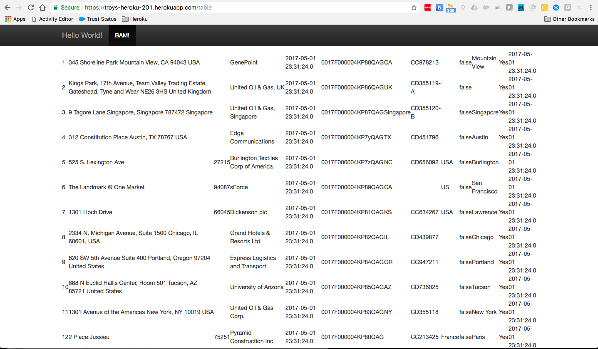


 Now, you may be well ahead of the alloted time for this exercise so feel free to attempt a form submit and write back to the database.. for the rest of us, let's use Heroku CLI to update our tables and see if we can sync back to Salesforce. 

## Connect Directly via JDBC

Lastly, we want to make a simple change to some data.. rather than implement a form that accepts a change in the app, lets just update using the heroku tools. You will need to have Postgres installed locally for this to work


If you don't want to install postgres, a tool like [Postico](https://eggerapps.at/postico/) can help to run queries against your Postgres.

Once you update, jump into Salesforce to check the change. Have a look in your Heroku Connect dashboard and see if you can see the change there as well. 


As usual, if you have had enough of wondering why your's isn't working.. 

[](https://heroku.com/deploy)

Now, if you really want some extra credit see if you can configure Redis as a [session store](http://www.ninjaframework.org/documentation/basic_concepts/sessions.html) for your application! 
